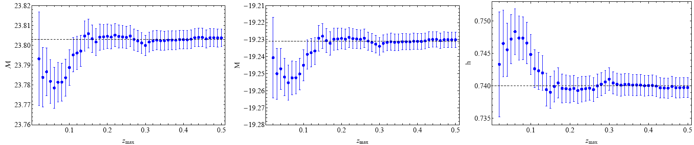

# Hints of a Local Matter Underdensity or Modified Gravity in the Low z Pantheon data

This is the repository that contains the Mathematica code as well as useful comments that reproduce the figures of [arxiv:2004.02155](https://arxiv.org/pdf/2004.02155.pdf)

## Abstract 
A redshift tomography of the Pantheon type Ia supernovae (SnIa) data focusing on the best fit value of the absolute magnitude 

and or  in the context of  indicates a local variation 
 at 
 
level, with respect to the best fit of the full dataset. If this variation is not due to a statistical fluctuation, it can be 
interpreted as a locally higher value of  by about , 
corresponding to a local matter underdensity . 
It can also be interpreted as a time variation of Newton's constant which implies an evolving Chandrasekhar mass and thus an 
evolving absolute luminosity  and absolute magnitude  of low  SnIa. The local void scenario would predict a degree of 
anisotropy in the best fit value of  since it is unlikely that we are located at the center of a 
local spherical underdensity. Using a Hemisphere Comparison method, we find an anisotropy level that is consistent with simulated 
isotropic Pantheon-like datasets. We show however, that the anisotropic sky distribution of the Pantheon SnIa data induces a preferred 
range of directions even in simulated Pantheon data obtained in the context of isotropic . We thus construct a more isotropically
distributed subset of the Pantheon SnIa and show that the preferred range of directions disappears. Using this more isotropically 
distributed subset we again find no evidence for statistically significant anisotropy using either the hemisphere comparison method 
or the dipole fit method. In the context of the modified gravity scenario, we allow for an evolving normalized Newton's constant 
consistent with General Relativity (GR) at early and late times 

  

and fit for the parameter  assuming . 
For  
indicated by some previous studies we find 
which is more than 
away from the GR value of .
This weak hint for weaker gravity at low  
coming from SnIa is consistent with similar evidence from growth and weak lensing cosmological data.

## Citing the paper 
If you use any of the above codes or the figures in a published work please cite the following paper:
 *Hints of a Local Matter Underdensity or Modified Gravity in the Low z Pantheon data.*
 Lavrentios Kazantzidis and Leandros Perivolaropoulos, [arxiv:2004.02155](https://arxiv.org/pdf/2004.02155.pdf)

Any further questions/comments are welcome

## Authors List
Lavrentios Kazantzidis - <l.kazantzidis@uoi.gr>
 Leandros Perivolaropoulos - <leandros@uoi.gr>

